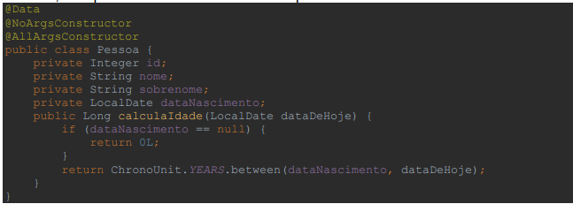
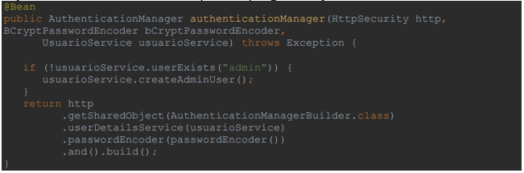
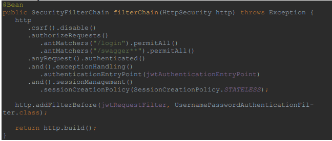
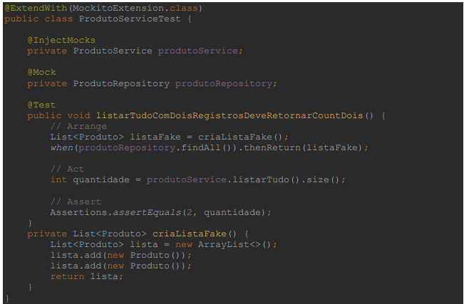
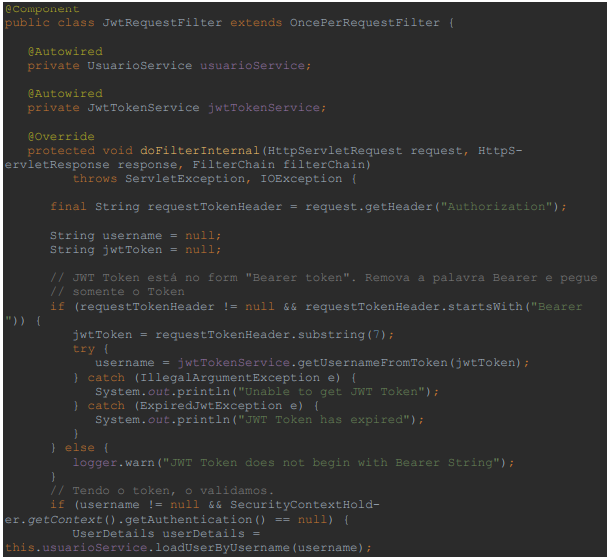
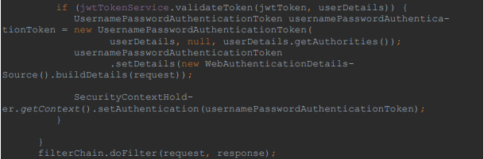

# Sprint 6 - Spring Avançado - Teórico

**1 -** O que é SOLID?

**2 -** Quais são os princípios do SOLID?

**3 -** Defina o princípio da responsabilidade única

**4 -** Defina o princípio do Aberto/Fechado

**5 -** Defina o Princípio da Substituição de Liskov

**6 -** Defina o Princípio da Segregação de Interface

**7 -** Defina o Princípio de Inversão de Dependência

**8 -** O que são testes unitários e qual é a sua importância no ciclo de
desenvolvimento de Software moderno?

**9 -** Considerando a classe “Pessoa” apresentada abaixo, implemente uma classe
de teste, com pelo menos dois casos de teste para o método “calcularIdade”

**10 -** Dado o método de configuração “authenticationManager” apresentado abaixo,
apresente quais são as exigências necessárias para que o usuarioService e usuário
sejam consideradas como válidas para o Spring Security

**11 -** Dado o método de configuração filterChain do Spring Secutity, altere o código
de forma que seja possível acessar também a url /sobre, sem a necessidade de
autenticação.

**12 -** Considerando a classe de testes apresentada abaixo, explique qual é a
diferença entre @InjectMock e @Mock

**13 -** Considerando a classe JwtRequestFilter apresentada abaixo, indique em que
momento do código o usuário é autenticado e considerado válido dentro do Spring
Security

**14 -** Explique, com suas palavras, o processo de autenticação da API utilizando
Token JWT.

**15 -** Dado uma aplicação Spring Boot, quais são os procedimentos necessários
para habilitar as funcionalidades de Segurança e autenticação por JWT.